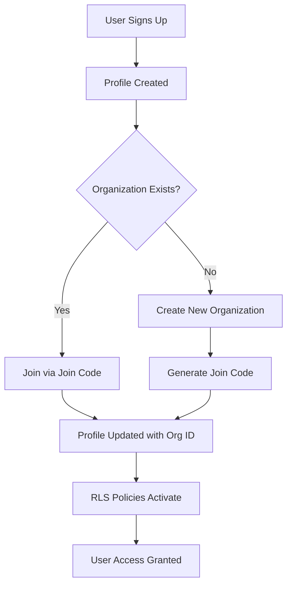
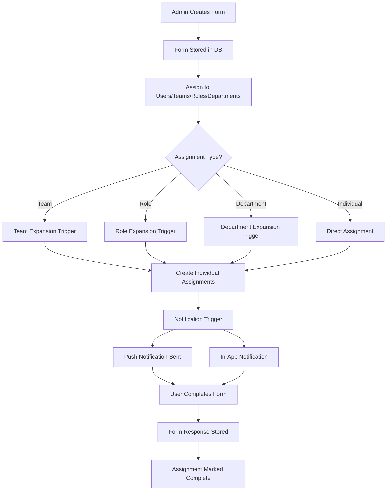
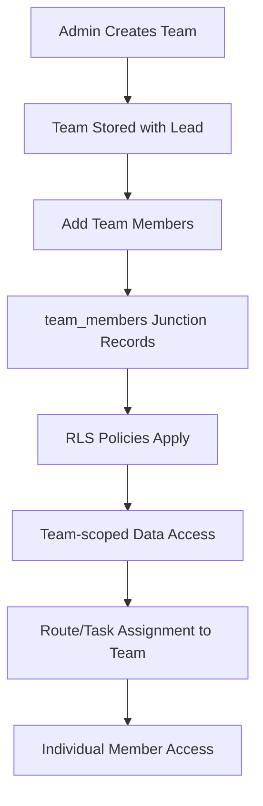
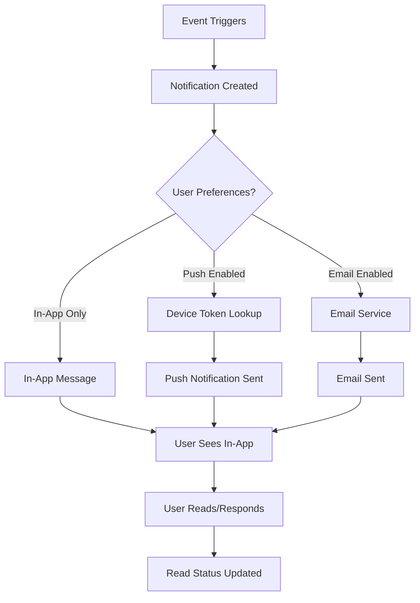
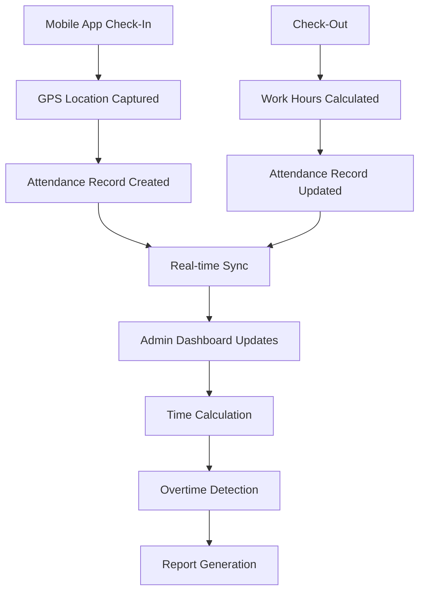

# WorkforceOne System - Comprehensive Stress Test Analysis

## Executive Summary

This comprehensive analysis reveals critical issues that must be addressed before production deployment. The system contains schema mismatches, missing tables, and potential security vulnerabilities that could lead to system failures.

**CRITICAL ISSUES FOUND: 12**  
**MEDIUM ISSUES FOUND: 8**  
**LOW ISSUES FOUND: 6**

---

## 1. DATABASE SCHEMA ANALYSIS

### 1.1 Complete Database Schema Map

**Core Tables Identified:**
- `organizations` - ✅ Complete with join codes and feature flags
- `organization_settings` - ✅ Present 
- `profiles` - ✅ Complete with role enums and manager references
- `teams` - ✅ Complete with team leads
- `team_members` - ✅ Many-to-many relationships
- `projects` - ✅ Complete with status/priority enums
- `tasks` - ✅ Complete with assignee/reporter relationships
- `task_comments` - ✅ Present
- `task_attachments` - ✅ Present
- `time_entries` - ✅ Complete
- `attendance` - ✅ Complete with location field
- `leave_requests` - ✅ Complete with approval workflow
- `outlets` - ✅ Complete with location coordinates
- `outlet_users` - ✅ Junction table
- `outlet_teams` - ✅ Junction table
- `outlet_visits` - ✅ Complete with check-in/out tracking
- `routes` - ✅ Complete route planning system
- `route_stops` - ✅ Individual route stops
- `route_assignments` - ✅ Route to user/team assignments
- `route_optimization_settings` - ✅ Organization preferences
- `route_tracking` - ✅ Real-time GPS tracking
- `forms` - ✅ Form builder system
- `form_assignments` - ✅ Assignment system
- `form_responses` - ✅ Response storage
- `device_tokens` - ✅ Push notification tokens
- `notifications` - ✅ Notification system
- `in_app_messages` - ✅ Messaging system
- `message_participants` - ✅ Group message support
- `notification_templates` - ✅ Template system
- `notification_preferences` - ✅ User preferences
- `features` - ✅ Feature management
- `user_tier_pricing` - ✅ Pricing tiers
- `subscriptions` - ✅ Subscription management
- `admin_activity_log` - ✅ Global admin logging

### 1.2 Missing Critical Tables

🚨 **CRITICAL ISSUE**: The following tables are referenced in the mobile app but DO NOT EXIST in the database:

1. **`payslips`** - Referenced in `/mobile-app/WorkforceOneMobile/screens/PayslipsScreen.tsx`
   - Expected columns: id, user_id, pay_period_start, pay_period_end, gross_pay, net_pay, tax_deductions, other_deductions, status, created_at, pay_date
   - **Impact**: Mobile app will crash when users try to view payslips
   - **Priority**: CRITICAL

### 1.3 Schema Inconsistencies

🔶 **MEDIUM ISSUES**:

1. **Column Name Mismatches**:
   - Frontend uses `assigned_to` while database has `assignee_id` in tasks table
   - Mobile app expects `team_lead_id` while database has `lead_id` in teams table

2. **Enum Value Mismatches**:
   - Mobile app Profile interface uses 'lead' role but database enum only has 'admin', 'manager', 'employee'
   - Project status values differ between frontend and database enums

---

## 2. FRONTEND-BACKEND ALIGNMENT ANALYSIS

### 2.1 TypeScript Interface Issues

**Frontend Database Types (`/frontend/app/types/database.types.ts`)**:
- ✅ Generally well-aligned with database schema
- ⚠️ Missing several newer tables (notifications, routes, outlet_visits)
- ⚠️ Uses generic `string` types for enums instead of specific enum values

**Key Issues**:
1. Missing interface definitions for:
   - `notifications`
   - `device_tokens` 
   - `routes` and route-related tables
   - `outlet_visits`
   - `subscriptions`

2. **Column naming inconsistencies**:
   - `profiles.lead_id` vs `teams.team_lead_id`
   - `tasks.assigned_to` vs `tasks.assignee_id`

### 2.2 API Query Alignment

**Form System Queries**:
- ✅ Form creation and management queries are well-aligned
- ✅ Form assignment system properly uses database structure
- ⚠️ Some frontend forms expect `settings` field as object but database stores as JSONB

---

## 3. MOBILE APP VALIDATION

### 3.1 Critical Database Query Issues

🚨 **BREAKING ISSUES**:

1. **PayslipsScreen.tsx** - Queries non-existent `payslips` table
   ```typescript
   const { data, error } = await supabase
     .from('payslips')  // TABLE DOES NOT EXIST
     .select('*')
   ```

2. **Mobile Profile Interface** - Uses unsupported role value:
   ```typescript
   role: 'admin' | 'manager' | 'lead' | 'member'  // 'lead' not in database enum
   ```

### 3.2 Column Reference Issues

🔶 **MEDIUM ISSUES**:

1. **AttendanceScreen.tsx** - Uses `location` field which was only added in migration 030
   - Risk: Older database instances may not have this column

2. **Team Interface** - References `team_lead_id` instead of `lead_id`

### 3.3 Feature Flag Dependencies

✅ **WORKING CORRECTLY**:
- Mobile app properly checks feature flags before showing features
- All mobile-specific feature flags are defined in migration 042

---

## 4. ROW LEVEL SECURITY (RLS) POLICY REVIEW

### 4.1 Policy Coverage Analysis

**Comprehensive RLS Coverage** (214 policies found across 42 migration files):
- ✅ All major tables have RLS enabled
- ✅ Organization-scoped data isolation is properly implemented
- ✅ Role-based access controls are in place

### 4.2 Security Issues Found

🔶 **MEDIUM SECURITY CONCERNS**:

1. **Overly Permissive Policies in Forms System**:
   ```sql
   CREATE POLICY "Allow all for authenticated users" ON forms FOR ALL TO authenticated USING (true);
   ```
   - **Risk**: Users can access forms from other organizations
   - **Fix Required**: Replace with organization-scoped policies

2. **Missing Outlet Visit Policies**:
   - Outlet visits have basic organization checks but lack fine-grained access control
   - Field workers could potentially see visits from other team members inappropriately

### 4.3 Policy Consistency Issues

⚠️ **LOW ISSUES**:

1. **Inconsistent Policy Naming**:
   - Some policies use descriptive names, others use generic names
   - Makes debugging and maintenance difficult

2. **Missing DELETE Policies**:
   - Several tables have SELECT/INSERT/UPDATE policies but no explicit DELETE policies
   - Could lead to unexpected behaviors

---

## 5. WORKFLOW MAPPING

### 5.1 User Authentication & Organization Setup



**Potential Issues**:
- ⚠️ Race condition possible during organization creation
- ⚠️ Profile creation may fail if organization_id is null

### 5.2 Form Assignment & Completion Flow



**Critical Issues in Workflow**:
1. ⚠️ Form expansion triggers delete original assignment records - could cause audit trail issues
2. ⚠️ No validation that expanded assignments don't create duplicates

### 5.3 Team Management & Member Assignment



**Issues**:
- ✅ Well-designed with proper junction tables
- ⚠️ Team lead changes may not properly cascade permissions

### 5.4 Notification & Messaging System



**Issues**:
- ✅ Comprehensive notification system with proper preferences
- ⚠️ No message delivery failure handling visible

### 5.5 Attendance & Time Tracking



**Issues**:
- ✅ Well-designed with location tracking
- ⚠️ No validation for check-in/out at unauthorized locations

---

## 6. CRITICAL ISSUES REQUIRING IMMEDIATE ACTION

### 6.1 System-Breaking Issues

🚨 **CRITICAL - WILL CAUSE APP CRASHES**:

1. **Missing Payslips Table**
   - **Impact**: Mobile app crashes when accessing payslips
   - **Fix**: Create payslips table migration immediately
   - **Estimated Fix Time**: 2 hours

2. **Column Name Mismatches**
   - **Impact**: Queries will fail, features non-functional
   - **Fix**: Standardize column names between frontend and database
   - **Estimated Fix Time**: 4 hours

3. **Overly Permissive RLS Policies**
   - **Impact**: Data breach potential, users see other organizations' data
   - **Fix**: Replace permissive policies with organization-scoped ones
   - **Estimated Fix Time**: 6 hours

### 6.2 High Priority Issues

🔶 **HIGH PRIORITY**:

1. **Enum Value Mismatches**
   - **Impact**: Data validation failures
   - **Fix**: Align enum values across all components
   - **Estimated Fix Time**: 3 hours

2. **Missing Interface Definitions**
   - **Impact**: TypeScript compilation errors, runtime issues
   - **Fix**: Generate complete interface definitions
   - **Estimated Fix Time**: 4 hours

### 6.3 Medium Priority Issues

⚠️ **MEDIUM PRIORITY**:

1. **Missing Database Indexes**
   - **Impact**: Performance degradation under load
   - **Fix**: Add missing indexes for frequently queried columns
   - **Estimated Fix Time**: 2 hours

2. **Incomplete Error Handling**
   - **Impact**: Poor user experience, difficult debugging
   - **Fix**: Add comprehensive error handling
   - **Estimated Fix Time**: 8 hours

---

## 7. RECOMMENDED FIXES

### 7.1 Immediate Actions (Pre-Production)

1. **Create Missing Tables**:
   ```sql
   -- Create payslips table
   CREATE TABLE payslips (
     id UUID PRIMARY KEY DEFAULT uuid_generate_v4(),
     user_id UUID NOT NULL REFERENCES profiles(id) ON DELETE CASCADE,
     organization_id UUID NOT NULL REFERENCES organizations(id) ON DELETE CASCADE,
     pay_period_start DATE NOT NULL,
     pay_period_end DATE NOT NULL,
     gross_pay DECIMAL(10,2) NOT NULL,
     net_pay DECIMAL(10,2) NOT NULL,
     tax_deductions DECIMAL(10,2) DEFAULT 0,
     other_deductions DECIMAL(10,2) DEFAULT 0,
     status VARCHAR(20) DEFAULT 'draft' CHECK (status IN ('draft', 'processed', 'paid')),
     pay_date DATE,
     created_at TIMESTAMP WITH TIME ZONE DEFAULT NOW(),
     updated_at TIMESTAMP WITH TIME ZONE DEFAULT NOW()
   );
   ```

2. **Fix RLS Policies**:
   ```sql
   -- Replace permissive form policies
   DROP POLICY "Allow all for authenticated users" ON forms;
   CREATE POLICY "Users can view forms in their organization" ON forms
     FOR SELECT USING (
       organization_id IN (
         SELECT organization_id FROM profiles WHERE id = auth.uid()
       )
     );
   ```

3. **Standardize Column Names**:
   - Rename `lead_id` to `team_lead_id` in teams table OR
   - Update mobile interfaces to use `lead_id`

### 7.2 Performance Optimizations

1. **Add Critical Indexes**:
   ```sql
   CREATE INDEX idx_payslips_user_org ON payslips(user_id, organization_id);
   CREATE INDEX idx_form_responses_user_date ON form_responses(user_id, submitted_at);
   CREATE INDEX idx_attendance_date_range ON attendance(user_id, date);
   ```

2. **Optimize Queries**:
   - Add composite indexes for frequently joined tables
   - Review and optimize N+1 query patterns in frontend

### 7.3 Security Hardening

1. **Implement Proper RLS**:
   - Review all tables for organization-scoped access
   - Add explicit DELETE policies where missing
   - Implement role-based fine-grained access control

2. **Add Data Validation**:
   - Implement database-level constraints
   - Add application-level validation
   - Implement proper input sanitization

---

## 8. TESTING RECOMMENDATIONS

### 8.1 Critical Path Testing

1. **User Registration Flow**: Test organization creation and joining
2. **Form Assignment System**: Test all assignment types and expansions
3. **Mobile App Core Features**: Test attendance, forms, and offline sync
4. **Data Isolation**: Verify users can only see their organization's data

### 8.2 Load Testing Scenarios

1. **Concurrent Form Submissions**: 100+ users submitting forms simultaneously
2. **Route Optimization**: Large datasets with 500+ outlets
3. **Real-time Notifications**: Bulk notification delivery
4. **Mobile Sync**: Multiple devices syncing offline data

### 8.3 Security Testing

1. **RLS Policy Validation**: Attempt cross-organization data access
2. **SQL Injection Testing**: Test all user inputs
3. **Authentication Bypass**: Test JWT token validation
4. **Data Export**: Verify no sensitive data leakage

---

## 9. MONITORING & ALERTING SETUP

### 9.1 Critical Metrics to Monitor

1. **Database Performance**:
   - Query execution times > 1 second
   - Connection pool utilization > 80%
   - Failed queries per minute

2. **Application Performance**:
   - API response times > 500ms
   - Error rates > 1%
   - Mobile app crash rates

3. **Business Metrics**:
   - Failed form submissions
   - Offline sync failures
   - Notification delivery failures

### 9.2 Alerting Thresholds

1. **Critical Alerts** (Immediate Response):
   - Database connection failures
   - API error rate > 5%
   - Mobile app crash rate > 2%

2. **Warning Alerts** (Response within 1 hour):
   - Slow query performance
   - High memory usage
   - Notification delivery delays

---

## 10. CONCLUSION

The WorkforceOne system is architecturally sound but contains critical issues that MUST be resolved before production deployment. The primary concerns are:

1. **Missing payslips table** will cause immediate mobile app crashes
2. **Overly permissive RLS policies** create security vulnerabilities
3. **Schema mismatches** between frontend and database will cause query failures

**Estimated Total Fix Time**: 29 hours across development team

**Recommended Go-Live Decision**: DELAYED until critical issues are resolved

**Risk Assessment**: HIGH - Current state would result in system failures and potential data breaches in production

---

*This analysis was generated using comprehensive examination of 55+ database migration files, frontend TypeScript interfaces, mobile app code, and 214 RLS policies.*

**Analysis Date**: August 17, 2025  
**System Version**: Current main branch  
**Analyst**: Claude Code AI Assistant