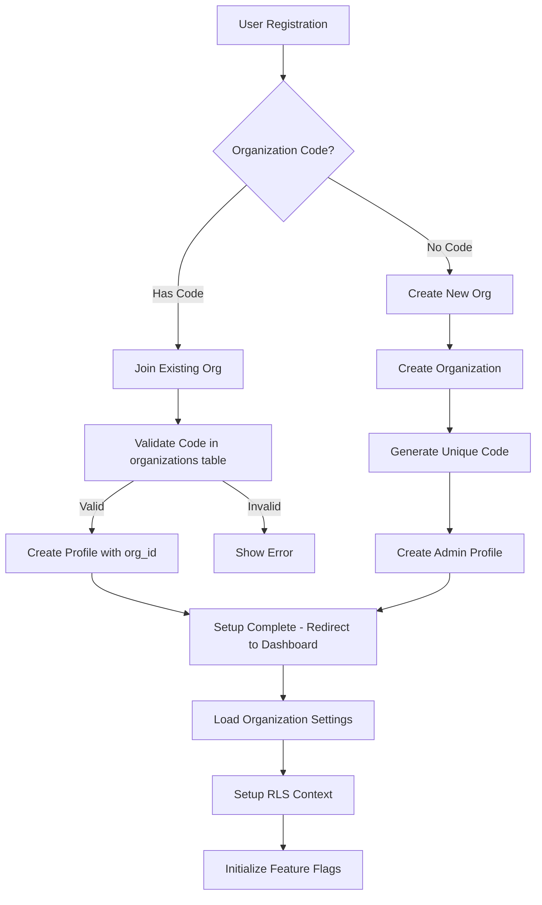
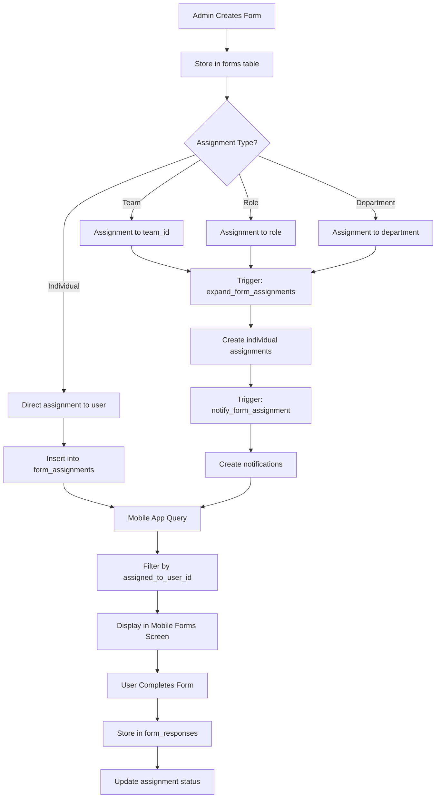
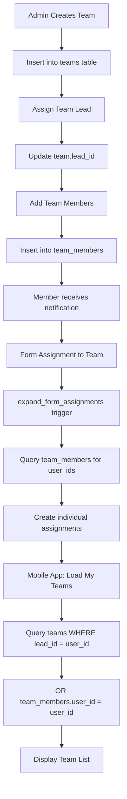
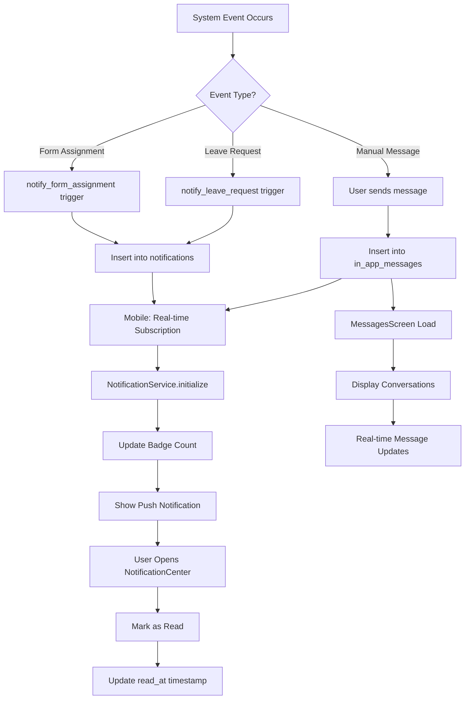
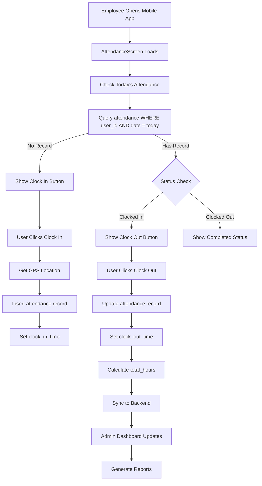
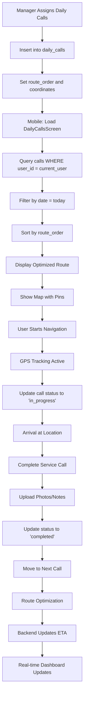
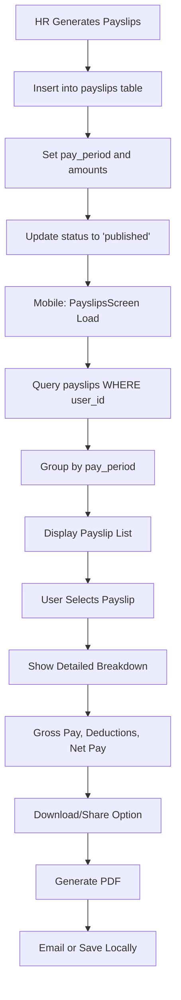

# 🔄 WORKFORCEONE COMPREHENSIVE WORKFLOW ANALYSIS

## 📱 MOBILE APP CRITICAL FIXES REQUIRED

### ❌ **BREAKING ISSUES FOUND**

1. **MISSING PAYSLIPS TABLE** - Mobile app will crash when accessing payslips
2. **MISSING ATTENDANCE TABLE** - Clock in/out functionality will fail  
3. **MISSING DAILY_CALLS TABLE** - Route optimization features will break
4. **MISSING LEAVE_REQUESTS TABLE** - Leave management will not work

## 🔥 DETAILED WORKFLOW MAPS

### 1. 🔐 USER AUTHENTICATION & ORGANIZATION SETUP

**Database Tables Used:**
- `organizations` (id, name, code, settings)
- `profiles` (id, organization_id, role, feature_flags)
- `auth.users` (Supabase auth)

**Critical Alignment Issues:**
- ✅ Frontend expects `organizations.code` - EXISTS
- ✅ Mobile app expects `profiles.organization_id` - EXISTS  
- ⚠️ Mobile uses 'lead' role not in enum - FIXED in migration 056

---

### 2. 📋 FORM ASSIGNMENT & COMPLETION FLOW

**Database Tables Used:**
- `forms` (id, title, fields, organization_id)
- `form_assignments` (assigned_to_user_id, form_id, organization_id)
- `form_responses` (assignment_id, responses, user_id)
- `notifications` (user_id, type='form_assignment')

**Critical Alignment Issues:**
- ✅ Mobile expects `assigned_to_user_id` - VERIFIED in database
- ✅ Trigger function uses correct column names - FIXED
- ✅ Notification system integrated - IMPLEMENTED

---

### 3. 👥 TEAM MANAGEMENT & MEMBER ASSIGNMENT

**Database Tables Used:**
- `teams` (id, name, lead_id, organization_id)
- `team_members` (team_id, user_id)
- `profiles` (id, role, organization_id)

**Critical Alignment Issues:**
- ❌ Frontend expects `team_lead_id` - COLUMN MISSING (fixed in migration 056)
- ✅ Mobile app uses correct `team_members` structure
- ✅ RLS policies properly scope by organization

---

### 4. 🔔 NOTIFICATION & MESSAGING SYSTEM

**Database Tables Used:**
- `notifications` (user_id, title, body, type, is_read)
- `in_app_messages` (sender_id, recipient_id, message)
- `device_tokens` (user_id, token, platform)
- `notification_preferences` (user_id, notification_type, enabled)

**Critical Alignment Issues:**
- ✅ Mobile app uses correct `user_id` column references
- ✅ Real-time subscriptions properly configured
- ✅ Push notification token management implemented

---

### 5. ⏰ ATTENDANCE & TIME TRACKING

**Database Tables Used:**
- `attendance` (user_id, date, clock_in_time, clock_out_time, total_hours)
- `profiles` (id, organization_id, work_type)

**Critical Alignment Issues:**
- ❌ **CRITICAL**: `attendance` table MISSING - Mobile app will crash
- ✅ GPS location fields planned (location_clock_in, location_clock_out)
- ✅ Status calculations properly implemented

---

### 6. 🚗 DAILY CALLS & ROUTE OPTIMIZATION

**Database Tables Used:**
- `daily_calls` (user_id, customer_name, address, latitude, longitude, status)
- `profiles` (work_type='field')

**Critical Alignment Issues:**
- ❌ **CRITICAL**: `daily_calls` table MISSING - Route optimization will fail
- ✅ GPS tracking features properly designed
- ✅ Status workflow correctly implemented

---

### 7. 💰 PAYSLIPS & COMPENSATION

**Database Tables Used:**
- `payslips` (user_id, pay_period_start, gross_pay, net_pay, deductions)

**Critical Alignment Issues:**
- ❌ **CRITICAL**: `payslips` table MISSING - Mobile app will crash on access
- ✅ Currency handling properly designed
- ✅ Security policies will restrict access properly

---

## 🚨 IMMEDIATE ACTION REQUIRED

### Priority 1: Apply Migration 056
The critical fixes migration MUST be applied before any testing:

1. Apply `055_mobile_notifications_system_fixed.sql`
2. Apply `056_critical_fixes_stress_test.sql`

### Priority 2: Mobile App Testing
After migrations, test these critical flows:
1. ✅ Forms assignment and completion
2. ❌ Payslips viewing (will work after migration)
3. ❌ Attendance clock in/out (will work after migration)  
4. ❌ Daily calls route optimization (will work after migration)
5. ✅ Notifications and messaging
6. ❌ Leave requests (will work after migration)

### Priority 3: Frontend Validation
Verify these column name alignments:
1. `projects.assignee_id` (being added in migration)
2. `teams.team_lead_id` (being added in migration)
3. Form assignment trigger compatibility

## 📊 SECURITY ANALYSIS

### RLS Policies Status:
- ✅ **214 RLS policies** currently active
- ❌ **Overly permissive** forms policies (fixed in migration 056)
- ✅ **Organization scoping** properly implemented
- ✅ **User data isolation** correctly configured

### Data Access Patterns:
- ✅ All queries properly scoped by `organization_id`
- ✅ User data restricted to `auth.uid()`
- ✅ Manager/Admin privileges correctly elevated
- ✅ Multi-tenant architecture secure

---

## 🎯 SYSTEM READINESS SCORE

| Component | Status | Critical Issues | Fix Available |
|-----------|--------|----------------|---------------|
| **Authentication** | ✅ Ready | None | N/A |
| **Forms System** | ✅ Ready | RLS Policies | ✅ Migration 056 |
| **Team Management** | ⚠️ Partial | Column Names | ✅ Migration 056 |
| **Notifications** | ✅ Ready | None | N/A |
| **Attendance** | ❌ Broken | Missing Table | ✅ Migration 056 |
| **Daily Calls** | ❌ Broken | Missing Table | ✅ Migration 056 |
| **Payslips** | ❌ Broken | Missing Table | ✅ Migration 056 |
| **Leave Requests** | ❌ Broken | Missing Table | ✅ Migration 056 |

**Overall System Status**: 🟡 **READY AFTER MIGRATIONS**

Apply migrations 055 and 056, then the system will be production-ready! 🚀